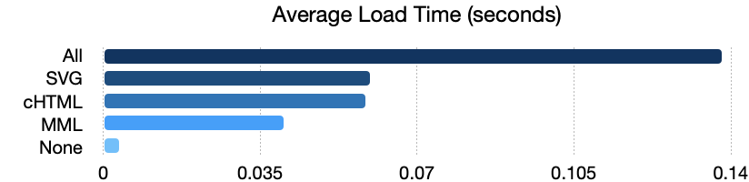
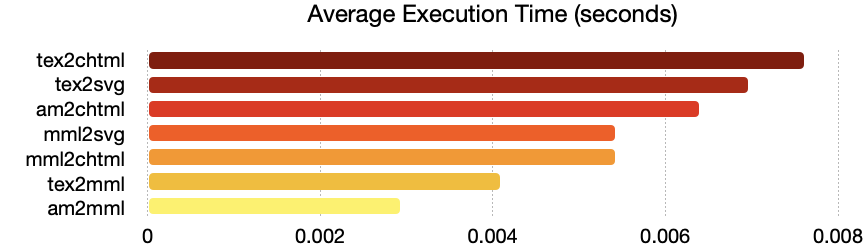

# MathJaxSwift

[](https://github.com/colinc86/MathJaxSwift/actions/workflows/swift.yml)    

<a href="https://www.mathjax.org">
    
</a>

`MathJaxSwift` converts and renders math expressions in Swift by incorporating [MathJax](https://github.com/mathjax/MathJax)[^1] source code and using the [JavaScriptCore](https://developer.apple.com/documentation/javascriptcore) framework. It wraps the MathJax conversion processes in convenient JavaScript methods [described here](https://github.com/mathjax/MathJax-demos-node/tree/master/direct) and exposes them to Swift through the `JavaScriptCore` framework.

[^1]: `MathJaxSwift` is not affiliated with [MathJax](https://github.com/mathjax/MathJax) or any of its related entities.

## Installation

Add the dependency to your package manifest file.

```swift
.package(url: "https://github.com/colinc86/MathJaxSwift", from: "3.2.2")
```

## Usage

Import the package, create a `MathJax` instance, and convert an input string to a supported output format.

```swift
import MathJaxSwift

do {
  let mathjax = try MathJax()
  let svg = try mathjax.tex2svg("\\text{Hello}, \\TeX{}!")
}
catch {
  print("MathJax error: \(error)")
}
```

> The example above converts the TeX input to SVG data that renders the following PNG.

<picture>
  <source media="(prefers-color-scheme: dark)" srcset="./assets/images/hello_tex_light.png">
  <source media="(prefers-color-scheme: light)" srcset="./assets/images/hello_tex_dark.png">
  
</picture>

### Available Methods

MathJaxSwift implements the following methods to convert [TeX](https://tug.org), [MathML](https://www.w3.org/TR/MathML/), and [AsciiMath](http://asciimath.org) to CommonHTML, MathML and SVG data.

| Method      | Input Format                            | Output Format |
| :---------- | :-------------------------------------- | :------------ |
| `tex2chtml` | TeX                                     | cHTML         |
| `tex2mml`   | TeX                                     | MathML        |
| `tex2svg`   | TeX                                     | SVG           |
| `mml2chtml` | MathML                                  | cHTML         |
| `mml2svg`   | MathML                                  | SVG           |
| `am2chtml`  | AsciiMath                               | cHTML         |
| `am2mml`    | AsciiMath                               | MathML        |

### Threading and Memory

Initializing an instance of `MathJax` should not be performed on the main queue to prevent blocking of the UI. You should also attempt to keep a single reference to an instance and submit your function calls to it instead of creating a new `MathJax` instance each time you need to convert.

> An example of what to do: 

```swift
import MathJaxSwift

class MyModel {
  let mathjax: MathJax
  
  init() throws {
    mathjax = try MathJax()
  }
  
  func convertTex(_ input: String) async throws -> String {
    return try await mathjax.tex2chtml(input)
  }
}
```

> An example of what _not_ to do: 

```swift
import MathJaxSwift

class MyModel {
  init() {}
  
  func convertTex(_ input: String) async throws -> String {
    let mathjax = try MathJax()
    return try await mathjax.tex2chtml(input)
  }
}
```

Each of the methods are also available with an `async` implementation. It is recommended that these methods are used over their synchronous counterparts wherever possible.

```swift
func myAsyncMethod() async throws {
  let mml = try await mathjax.tex2mml("\\frac{2}{3}")
  print(mml)
}
```

> Outputs the following MathML.

```xml
<math xmlns="http://www.w3.org/1998/Math/MathML" display="block">
  <mfrac>
    <mn>2</mn>
    <mn>3</mn>
  </mfrac>
</math>
```

You can specify which queue to execute on when calling async methods. The instance will use the `.global()` queue by default.

```swift
func myAsyncMethod() async throws {
  let mml = try await mathjax.tex2mml("\\frac{2}{3}", queue: myQueue)
}
```

#### Preferred Output Formats

MathJaxSwift loads all of the necessary JavaScript in to its context to run all of the conversion methods. In the case that you only want to utilize a subset of the package's output formats, you can instruct the `MathJax` instance to only initialize with your preferred output formats.

```swift
do {
  // Save some time and don't load the SVG output format.
  let mathjax = try MathJax(preferredOutputFormats: [.chtml, .mml])
}
catch {
  print("Error initializing MathJax: \(error)")
}
```

The benefit of this approach is that, instead of loading all of the necessary JavaScript in to the instance's context upon initialization, it loads the preferred output formats immediately, and then lazily loads any JavaScript in the future that may be required to execute a conversion method.

```swift
do {
  // We _think_ we only need CommonHTML, so save some time by only loading that
  // output format.
  let mathjax = try MathJax(preferredOutputFormat: .chtml)
  
  // The following is ok!
  let mml = try mathjax.tex2mml("\\text{Hello}, \\TeX{}!")
}
catch {
  print("MathJax error: \(error)")
}
```

See the [Notes](https://github.com/colinc86/MathJaxSwift#notes) section for more details.

### Block Rendering

Use the `inline` parameter to specify whether or not the input should be interpreted as inline text. Input is interpreted as `inline=false` by default which results in block output.

```swift
func myAsyncMethod() async throws {
  let mml = try await mathjax.tex2mml("\\frac{2}{3}", inline: true)
  print(mml)
}
```

> Compare the following MathML output to the output of the previous example.

```xml
<math xmlns="http://www.w3.org/1998/Math/MathML">
  <mfrac>
    <mn>2</mn>
    <mn>3</mn>
  </mfrac>
</math>
```

### Options

All of the methods that output SVG and HTML each support options passed as parameters; container and output options.

#### Container Options

To set parameters such as the font size, height, container width, etc., use either the `CHTMLContainerOptions` or `SVGContainerOptions` type.

For example, to set the font's size, create a container options instance and set the `em` and `ex` parameters.

#### Output Processor Options

The MathJax HTML and SVG output processors are also configurable using the same method as above, but by setting the `outputOptions` parameter to one of `CHTMLOutputProcessorOptions` or `SVGOutputProcessorOptions`.

For more information on the types of properties that can be set on the processor options, see [MathJax's Output Processor Options](https://docs.mathjax.org/en/latest/options/output/chtml.html).

```swift
let containerOptions = CHTMLContainerOptions(em: 24, ex: 12)
let outputOptions = CHTMLOutputProcessorOptions(scale: 2, fontCache: .none)

let html = try await mathjax.tex2chtml(
  "\\text{Hello}, \\TeX{}!", 
  containerOptions: containerOptions, 
  outputOptions: outputOptions)
```

### MathJax Version

To check the version of MathJax that has been loaded, use the static `metadata() throws` method.

```swift
do {
  let metadata = try MathJax.metadata()
  print(metadata.version)
}
catch {
  print("Error getting MathJax version: \(error)") 
}
```

You can also use the returned metadata to check the MathJax node module's URL and its SHA-512.

## Notes

To get around the limitations of the `JSContext` class, the package uses [Webpack](https://webpack.js.org) to create bundle files that can be evaluated by the context. The wrapper methods, MathJax, and Webpack dependencies are bundled together in an npm module called `mjn`. 

`mjn`'s main entry point is `index.js` which exposes the converter classes and functions that utilize MathJax. The files are packed with Webpack and placed in to the `mjn/dist/` directory. `chtml.bundle.js`, `mml.bundle.js`, and `svg.bundle.js` files are loaded by the Swift package's module and evaluated by a JavaScript context to expose the functions.

After making modifications to `index.js`, it should be rebuilt with `npm run build` executed in the `mjn` directory which will recreate the bundle files.

### Performance

As described in the [Preferred Output Formats](https://github.com/colinc86/MathJaxSwift#preferred-output-formats) section, you can lazily load the package's bundles. This will greatly improve load times and reduce overhead.

<picture>
  <source media="(prefers-color-scheme: dark)" srcset="./assets/images/load_time_light.png">
  <source media="(prefers-color-scheme: light)" srcset="./assets/images/load_time_dark.png">
  
</picture>

For example, if you only need CommonHTML formatted output, you can reduce loading overhead over 50% by only initializing with `chtml` set as the preferred output format.

<picture>
  <source media="(prefers-color-scheme: dark)" srcset="./assets/images/execution_time_light.png">
  <source media="(prefers-color-scheme: light)" srcset="./assets/images/execution_time_dark.png">
  
</picture>

Execution times are benchmarked with the XCTest `measure` method on a MacBook Pro, M1 Max, 64 GB, macOS Ventura 13.0.1.
